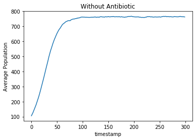
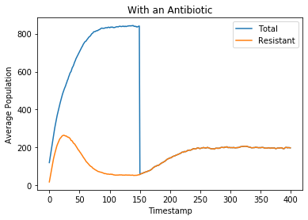
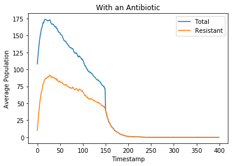

Concepts used:
1) Good use of functions within classes to simultae stochastic process

Screenshots of output: 
(one without antibiotic case, two with antibiotic cases with different bacteria death rates
Note: When the antibiotic is adminstered at step 150, only the resisitant bacterias survive)

